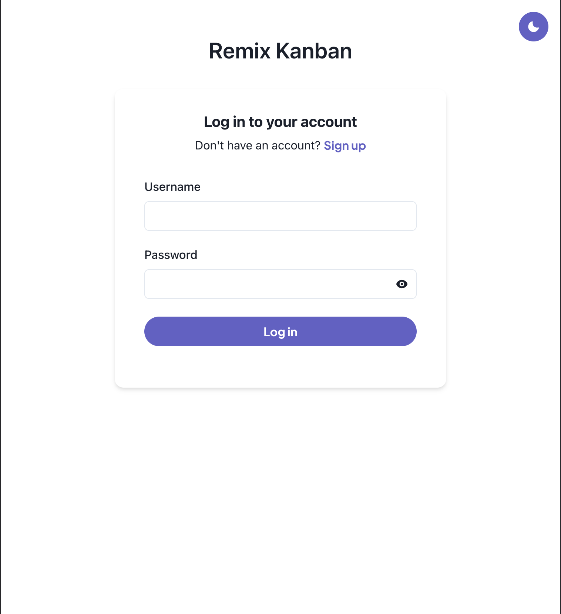
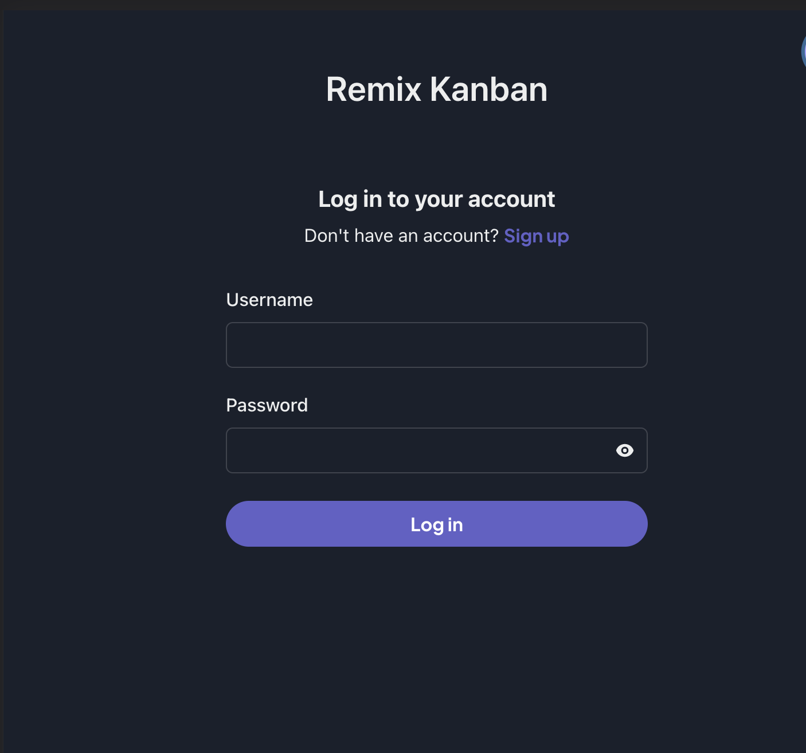
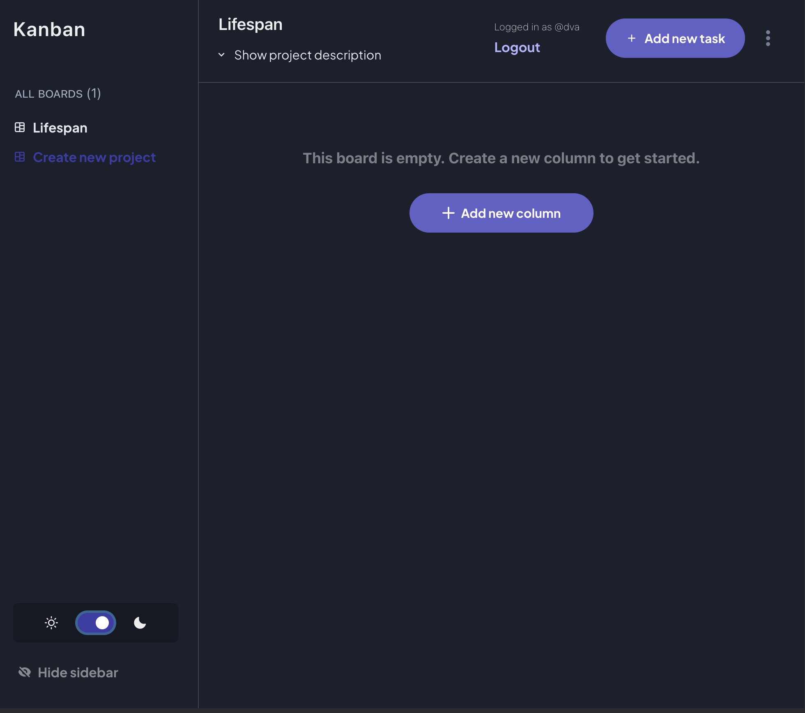

# Kanban practice project using Remix

## Tools

- [Remix](https://remix.run) for the "network chasm"
- Typescript
- React
- [Chakra UI](https://chakra-ui.com/) for styling
- [Prisma](https://prisma.io) ORM for sqlite db

## Status

Very much WIP / sandbox style but here are some screenshots of the current state:

### Screenshots

#### Login light mode



#### Login dark mode



#### Dashboard dark mode



> Rest is boilerplate from Remix :)

- [Remix Docs](https://remix.run/docs)

## Development

From your terminal:

```sh
npm run dev
```

This starts your app in development mode, rebuilding assets on file changes.

## Deployment

First, build your app for production:

```sh
npm run build
```

Then run the app in production mode:

```sh
npm start
```

Now you'll need to pick a host to deploy it to.

### DIY

If you're familiar with deploying node applications, the built-in Remix app server is production-ready.

Make sure to deploy the output of `remix build`

- `build/`
- `public/build/`

### Using a Template

When you ran `npx create-remix@latest` there were a few choices for hosting. You can run that again to create a new project, then copy over your `app/` folder to the new project that's pre-configured for your target server.

```sh
cd ..
# create a new project, and pick a pre-configured host
npx create-remix@latest
cd my-new-remix-app
# remove the new project's app (not the old one!)
rm -rf app
# copy your app over
cp -R ../my-old-remix-app/app app
```
